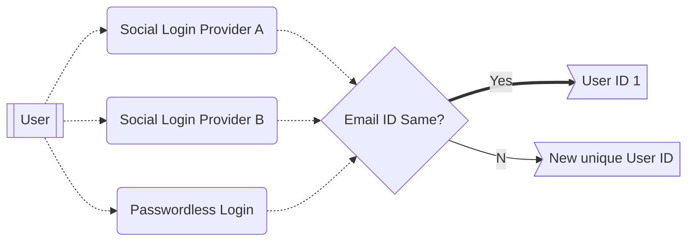

# Aggregate login

Aggregate Login in {{config.extra.arcana.sdk_name}} links users with the same email across social logins as one user. Different emails create separate developer accounts.

For example, logging in with Google and Twitter using the same email counts as one account, while different emails create separate accounts.

!!! an-warning "Limited Auth Provider Support"

      Aggregate login feature does not work for the following providers:

      * Cognito
      * Firebase
      * Steam
      * Telegram
      * Twitter
