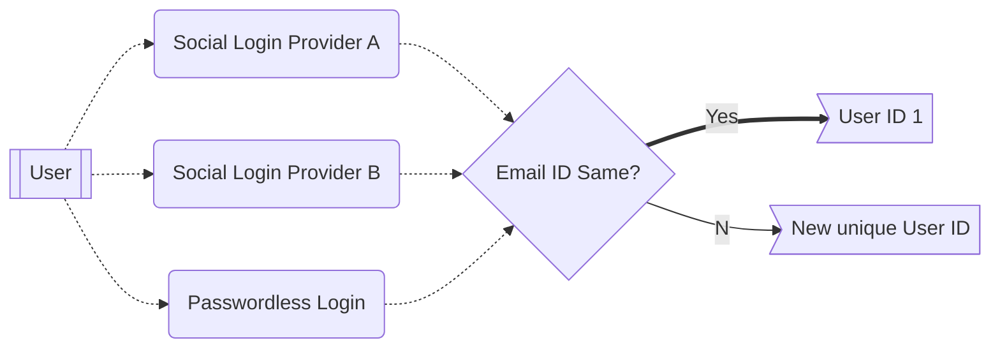

# Aggregate login

Aggregate Login in [[concept-authsdk| {{config.extra.arcana.sdk_name}}]] identifies app users with the same email across social logins. If multiple logins share an email, they're seen as one user. Different emails mean different developer accounts.

For example, if a user logs in with Google and Twitter, both linked to the same email, they're treated as a single user. However, if different emails are used, separate {{config.extra.arcana.company_name}} developer accounts are created.

Aggregate login in {{config.extra.arcana.dashboard_name}} groups developer accounts based on email. If different emails are used with multiple login options, they're treated as separate developer accounts, leading to different app configurations for each login. For instance, if a developer logs in with Google and Twitter, both using the same email, it's considered one developer account. However, if they use different emails, it creates separate developer accounts, affecting app configurations.

!!! an-caution "Not supported for all Auth Providers"

      Aggregate login feature does not work for the following providers:

      * Cognito
      * Firebase
      * Steam
      * Twitter

      If a user has the same email ID registered with these providers, logging into an app using either of them will create a new unique user account even if the user uses the same email as the one used with other social login provider or via the passwordless option.
