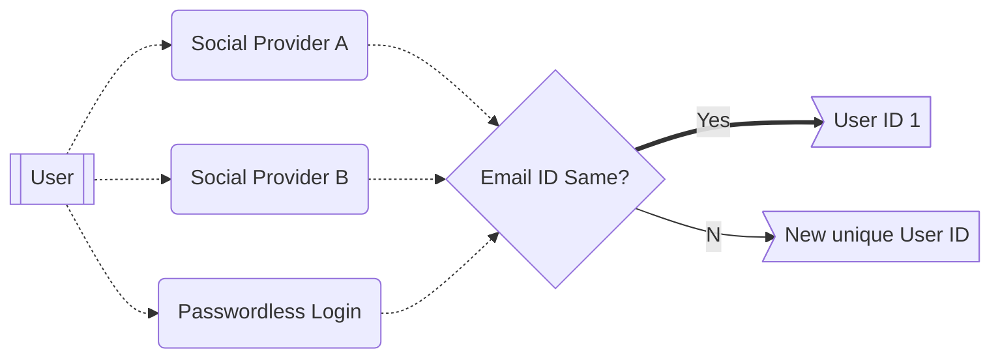

# Aggregate login

Aggregate Login refers to a feature in the [Arcana Auth SDK]({{page.meta.arcana.root_rel_path}}/concepts/authsdk.md) that can uniquely identify application users even if they use different social accounts to log in. This feature works **only** if the user has the same email ID associated with multiple social accounts.

What this means is that if an application user logs into an application integrated with the Auth SDK say, using Google, Twitter, or Twitch where each of these accounts belonging to the same developer is linked with a single email ID, then all these multiple login accounts will be treated as a single user. If the social accounts use different email IDs then these accounts may belong to the same user but Arcana Network will consider subsequent user login via a different onboarding option as a unique *new Arcana application user*. 

Aggregate login also works in the case of developers logging into the Arcana Dashboard to register and configure their applications. If a developer uses multiple login options to log into the dashboard and the email ID is not the same across the developer's social accounts, then each login is considered as a different unique developer account. In this case, any applications configured by the same developer via dashboard login through provider **'A'** will not be accessible to the same developer if they log into the dashboard via a different provider **'B'**.