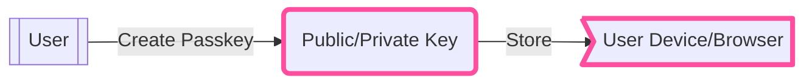
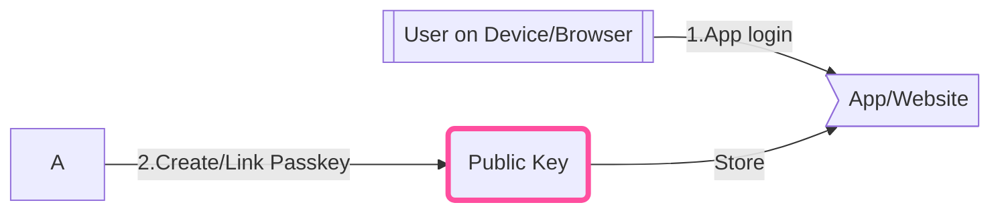
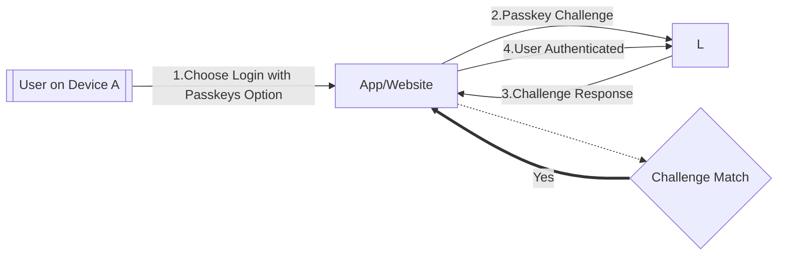

# Login with Passkey

The Passkeys Auth feature of the {{config.extra.arcana.sdk_name}} enables Web3 apps to onboard users through a biometric sensor (such as a fingerprint or facial recognition), a PIN, or a pattern supported by the OS or device where the app is running.

Passkey is a digital credential that binds a user account with a website or application.

Passkeys use public key cryptography that reduces the threat from potential data breaches. They are safer than passwords as they reduce the attack surface. Since passkeys are uniquely generated for every account by the user device and work only on the registered websites and apps, they are less vulnerable to phishing.



## How do Passkeys Work?

Passkeys are intended to be used through operating system infrastructure that allows passkey managers to create, backup, and make passkeys available to the applications running on that operating system.

Users aren't restricted to using the passkey only on the device where they're available. The passkey available on phones can be used when logging into a laptop, even if the passkey isn't synchronized to the laptop, as long as the phone is near the laptop and the user approves the sign-in on the phone.

Users must **create passkey** in order to be able to log into Web3 apps using passkeys on subsequent logins. To create a passkey for a website or application, a user must **first** signup with that website or application and follow up steps to create a passkey for that website or application. Each passkey is linked or bound to the app or website.



After setting up passkey for an account, on subsequent log in to the website or app, user can choose passkeys option to sign in. When signing in via passkeys, the browser or operating system will prompt them to select and use the right passkey. To validate and ensure that the rightful owner uses a passkey, the operating system will ask users to unlock their device before supplying the passkey for authentication.



## Security & Privacy

Passkeys are based on [FIDO standards](https://en.wikipedia.org/wiki/FIDO_Alliance), they work on Android, Chrome, Microsoft Windows, Microsoft Edge, MacOS, iOS and Safari.

Note that when signing in via a passkey, there is no biometric information or any sensitive information that is shared with the associated website for authentication. Also, passkeys by themselves do not allow tracking of users or devices across sites. Passkeys use public key cryptography. A public–private key pair is generated when a user creates a passkey for a site or application. This is generated on the user's device. Only the public key is stored by the site. Device based passkey managers protect passkeys from unauthorized access and use. 

Passkeys do not expire but they can be deleted and new ones created, if required.

## Authentication Flow

1. Log in to the {{config.extra.arcana.dashboard_name}} and register the app to get a unique  {{config.extra.arcana.app_address}}. Then configure [Passkey Usage Settings](#passkey-usage-settings) in the dashboard.

    ```mermaid
    graph TD
        DFLA{{Developer}} --Login --> setup
    
        subgraph setup[Arcana Developer Dashboard]
        direction LR  
            SP1[1. Register App] --> CLID((Unique ClientID))
            SP2[2. Configure App] --> SP3[Edit/Save Passkey Usage Settings]
        end
        classDef an-pink stroke:#ff4e9f,stroke-width:0.25rem; 
        class CLID an-pink

    ```
2. Install {{config.extra.arcana.sdk_name}}, integrate app with the SDK, initialize `AuthProvider` and then use `loginWithPasskeys()` method.

    ```mermaid
    graph TD
        DFLA{{Developer}} --install --> authsdk
        DFLA --ClientID -->AUTHP
        DFLA -->COA
        subgraph app[App]
            AUTHP[Create/Init AuthProvider] --> authsdk
            COA[Call loginWithPasskeys] --> authsdk
            subgraph authsdk[Arcana Auth SDK]
            direction TB 
                SDK1[AuthProvider Interface] 
            end
        end
        linkStyle 1,2 stroke: deeppink;
        authsdk --Process Passkeys Login --> STD[Standard Passkey Validation via OS/Browser]
        authsdk --Fetch Key Shares --> BEP[Arcana Auth Protocol] <--> BEK[DKG]
    ```

3. The {{config.extra.arcana.sdk_name}} uses the application details from the dashboard settings and `loginWithPasskeys` input data for Passkeys login processing. After verification, it gets the user's key shares from the {{config.extra.arcana.company_name}} backend and generates a user specific key locally in the app. This key lets users securely sign blockchain transactions.

    ```mermaid
    graph LR
        BED[Arcana Developer Dashboard] --Passkey Usage Settings--> BEC{Gateway} 
        BEC <--> BEA[Arcana Auth Protocol] <--> BEDKG[DKG]
    ```

## Passkey Usage Settings

To enable passkey login for an app, as part of configuration settings, the developer must use the {{config.extra.arcana.sdk_name}} and specify the **Domain** of the relying party. The domain is typically a CNAME or vanity URL.

!!! an-tip "Relying Party"

      The relying party is the website or Web3 app that allows user to create passkeys or authenticate with passkeys.

When a user enrolls a passkey, it associates with the relying party domain. If the domain name changes at any time, all of the passkeys associated with the old domain become invalid.