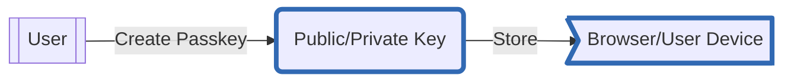
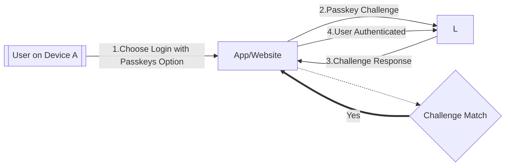
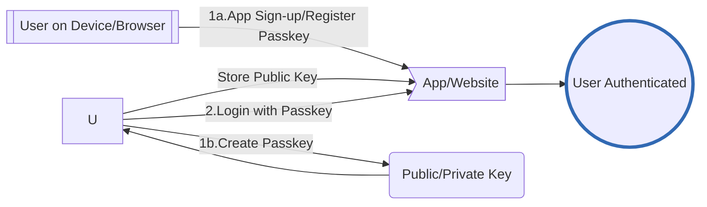
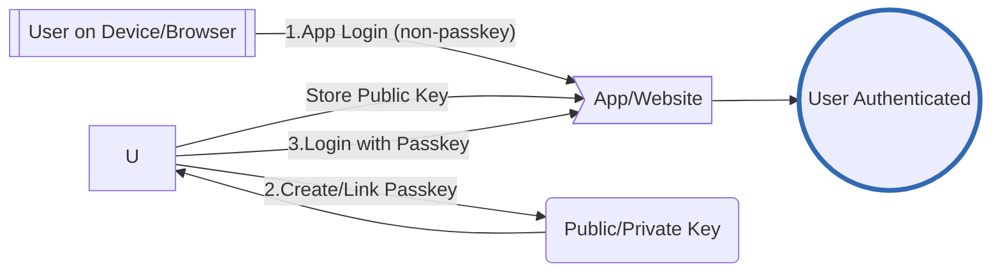

# Passkey Auth

Passkey is a digital credential that binds a user account with a website or application.

Passkeys use public key cryptography that reduces the threat from potential data breaches. They are safer than passwords as they reduce the attack surface. Since passkeys are uniquely generated for every account by the user device and work only on the registered websites and apps, they are less vulnerable to phishing.

The Passkeys Auth feature in the {{config.extra.arcana.sdk_name}} lets Web3 apps to onboard users through a biometrics sensor (such as a fingerprint or facial recognition), a PIN, or a pattern supported by the OS or device where the app is running.



## Security & Privacy

Passkeys are based on [FIDO standards](https://en.wikipedia.org/wiki/FIDO_Alliance), they work on Android, Chrome, Microsoft Windows, Microsoft Edge, MacOS, iOS and Safari.

Note that when logging in to an app via a passkey, there is no biometrics information or any sensitive information that is shared with the associated website for authentication. Also, passkeys by themselves do not allow tracking of users or devices across sites. Passkeys use public key cryptography. A public–private key pair is generated when a user creates a passkey for a site or application. This is generated on the user's device. Only the public key is stored by the site. Device based passkey managers protect passkeys from unauthorized access and use. 

Passkeys do not expire but they can be unlinked/deleted and new ones linked/created, if required.

## How do Passkeys Work?

Passkeys are intended to be used through operating system infrastructure that allows passkey managers to create, backup, and make passkeys available to the applications running on that operating system.

Each passkey is linked or bound to the app or website.

Users aren't restricted to using the passkey only on the device where they're available. The passkey available on phones can be used when logging into a laptop, even if the passkey isn't synchronized to the laptop, as long as the phone is near the laptop and the user approves the sign-in on the phone.



## Passkey Usage Options

Apps can enable passkey authentication for onboarding in two ways:

* Use passkeys for **sign-up & login**
* Offer passkeys as an **alternate login** method

### Sign-up & Login

Apps that support only passkey auth can go all-in on this option. Users can sign up, create an account, and set up passkey login all in one go—no need for any other login method.



For subsequent app logins, the browser or operating system will prompt the user to select and use one of the passkeys linked with the app. To validate and ensure that the rightful owner uses a passkey, the operating system may ask users to unlock their device before supplying the passkey for authentication.

### Alternate Login

Apps with multiple onboarding options only let users log in with passkeys after they’ve first used another login method and set up passkeys for future use.

Users need to sign up and log in using a different method before they can enable passkeys for future logins. Keep in mind, passkeys can’t be used for the initial sign-up.



After setting up passkey for an account, on the subsequent log in attempt to the website or app, passkeys can be used. When signing in via passkeys, the browser or operating system will prompt the user to select one of the passkey associated with the app or website. To validate and ensure that the rightful owner uses a passkey, the operating system may ask users to unlock their device before supplying the passkeys list to choose from.

## Passkey Configuration

1. Log in to the {{config.extra.arcana.dashboard_name}} and register the app to get a unique  {{config.extra.arcana.app_address}}. Then configure [domain](#domain) setting in the dashboard.

    ```mermaid
    graph TD
        DFLA{{Developer}} --Login --> setup
    
        subgraph setup[{{config.extra.arcana.dashboard_name}}]
        direction LR  
            SP1[1.Register App] --> CLID((Unique ClientID))
            SP2[2.Configure App] --> SP3[Edit/Save Passkey Usage Settings]
        end
        classDef an-highlight stroke:#3169b3,stroke-width:0.25rem; 
        class CLID an-highlight

    ```
2. Install {{config.extra.arcana.sdk_name}}, integrate it with your app, and initialize `AuthProvide`r. Choose the passkey onboarding option that fits your needs: use `registerWithPasskey()` for [[concept-auth-passkeys#sign-up-login|sign-up with passkey]] option or `linkPasskey()` for using passkey as an [[concept-auth-passkeys#alternate-login|alternate login]]. Then, log in users with   `loginWithPasskeys()`.

    ```mermaid
    graph TD
        DFLA{{Developer}} --1.Install --> authsdk
        DFLA --2.ClientID -->AUTHP
        DFLA --3.Select Sign-up/Alternate Login Passkey Onboarding -->POP -->COA
        subgraph app[App]
            AUTHP[Create/Init AuthProvider] --> authsdk
            COA[B. Call loginWithPasskeys] --> authsdk
            POP[A. Call registerWithPasskey/linkPasskey]
            subgraph authsdk[{{config.extra.arcana.sdk_name}}]
            direction TB 
                SDK1[AuthProvider Interface] 
            end
        end
        linkStyle 1,2 stroke: #3169b3;
        authsdk --Process Passkeys Login --> STD[Standard Passkey Validation via OS/Browser]
        authsdk --Fetch Key Shares --> BEP[{{config.extra.arcana.company_name}} Auth Protocol] <--> BEK[DKG]
    ```

3. The {{config.extra.arcana.sdk_name}} uses the application details from the dashboard settings and `loginWithPasskeys` input data for Passkeys login processing. After verification, it gets the user's key shares from the {{config.extra.arcana.company_name}} backend and generates a user specific key locally in the app. This key lets users securely sign blockchain transactions.

    ```mermaid
    graph LR
        BED[{{config.extra.arcana.dashboard_name}}] --Passkey Usage Settings--> BEC{Gateway} 
        BEC <--> BEA[{{config.extra.arcana.company_name}} Auth Protocol] <--> BEDKG[DKG]
    ```

### Domain

To enable passkey login for an app, as part of configuration settings, the developer must use the {{config.extra.arcana.sdk_name}} and specify the **Domain** of the relying party. The domain is typically a CNAME or vanity URL.

!!! an-tip "Relying Party"

      The relying party is the website or Web3 app that allows user to create passkeys or authenticate with passkeys.

When a user enrolls a passkey, it associates with the relying party domain. If the domain name changes at any time, all of the passkeys associated with the old domain become invalid.
