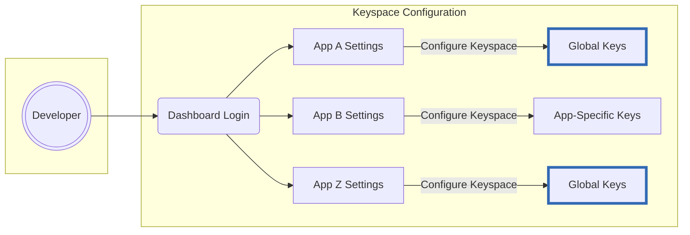
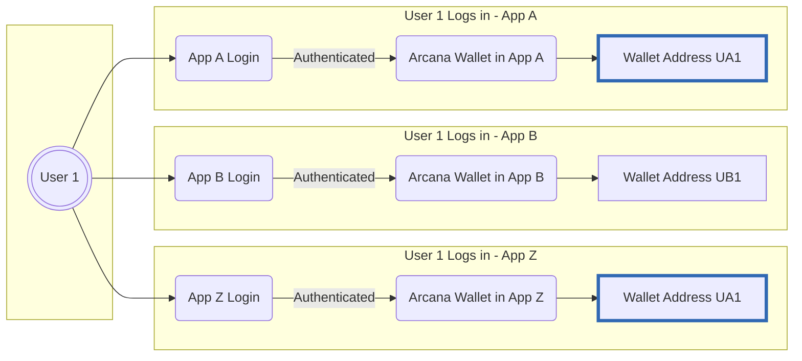

# Keyspace Types

{{config.extra.arcana.sdk_name}} supports the following key types:

=== "App-specific Keys"

    App-specific keys are unique to each Web3 app using the {{config.extra.arcana.sdk_name}}. If a user logs into two different apps with the SDK, they'll have a unique wallet address in each app.

=== "Global Keys"   

    In Web2, users often reuse passwords. Similarly, Web3 apps using {{config.extra.arcana.sdk_name}} can enable the same global wallet address across apps with the global keys option.

    While global keys streamline user experience, they pose a security risk. If one app is breached, a malicious actor could access the user’s digital assets across all apps using the same global keys.

## Enabling Global Keys

By default, apps use app-specific keys. Developers can switch to global keys via the {{config.extra.arcana.dashboard_name}}. To enable global keys, they must request activation through an online form. Activation may take a few hours for verification. Meanwhile, developers can continue using app-specific keys.

## UX with Global Keys

Switching to global keys in the {{config.extra.arcana.sdk_name}} changes the user experience with {{config.extra.arcana.wallet_name}}.

* If users previously had app-specific keys, they’ll see a new wallet address with global keys.

* Blockchain transaction signing will also change. With app-specific keys, a personal sign message pops up within the same app. With global keys, it opens in a new browser tab where users can sign and then close the tab.

<figure markdown="span"><figcaption>Wallet behavior (No clickjacking fix)</figcaption>

</figure><figure markdown="span"><figcaption>Wallet behavior (With clickjacking fix)</figcaption></figure>

## Switching Keyspace

Apps use app-specific keys by default. Developers can switch to global keys using the {{config.extra.arcana.dashboard_name}} based on privacy, security, or usability needs.

Note that Switching keyspace will change the user’s wallet address.

## Global Keys Limitations

* Apps that are configured to use the custom wallet UI option instead of using the default, built-in, {{config.extra.arcana.sdk_name}} UI **cannot** use global keys.

* Apps that are configured to use [[concept-custom-auth|Custom Auth]] feature **cannot** use global keys.

The reason for these restriction is to reduce a potential [[concept-keyspace-type#security|security vulnerability]]. 

## Security

{{config.extra.arcana.company_name}} follows a strict validation process for enabling global keys. However, using global keys may introduce security risks.

While global keys offer convenience by providing a consistent wallet address across apps, they also create a vulnerability. If one app turns malicious, the user's key could be exposed across all apps using global keys, leading to unauthorized access.
