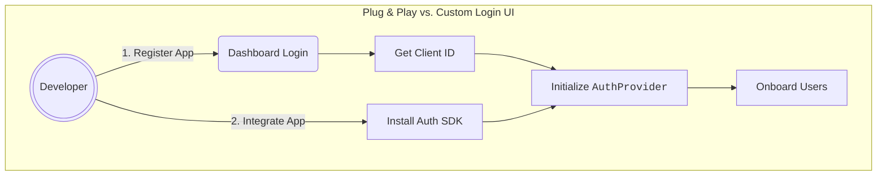
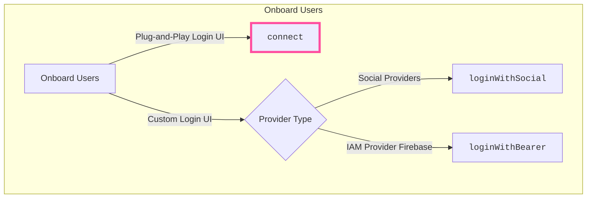

# Plug & Play Auth

In earlier beta releases, apps were required to integrate with the {{config.extra.arcana.sdk_name}} in order to onboard users with a custom login UI. For instance, the custom login UI code was required to call the `loginWithSocial('google')` method to onboard users via Google. Similarly, the passwordless login option was required to provision an email input field and call `loginWithLink` (deprecated), `loginWithOTPStart` and `loginWithOTPComplete` functions to onboard users.

Now, the latest Arcana Auth SDK offers a 'plug-and-play' feature, with a built-in login UI. Developers can choose to use custom login UI or get started faster with the built-in user onboarding via the 'plug-and-play auth' feature. 

Developers can now choose to use the [`connect`](https://authsdk-ref-guide.netlify.app/classes/authprovider#connect) method to bring up the built-in login UI, displaying [[index-configure-auth|configured onboarding options]] as setup using the [{{config.extra.arcana.dashboard_name}}]({{page.meta.arcana.root_rel_path}}/concepts/dashboard.md).

After successful authentication, users instantly access the {{config.extra.arcana.wallet_name}} for blockchain transactions. 

## Compact Plug & Play UI

When using the built-in plug-and-play login UI, developers can choose to use the standard login modal or a compact one by specifying the `compact: true` setting in the `connectOptions` while instantiating the `AuthProvider`. For details, see [`AuthProvider` constructor parameters](https://authsdk-ref-guide.netlify.app/interfaces/constructorparams).



<figure markdown="span">
  
  <figcaption>Login UI Types</figcaption>
</figure>

!!! an-tip "Arcana JWT Token"

     
