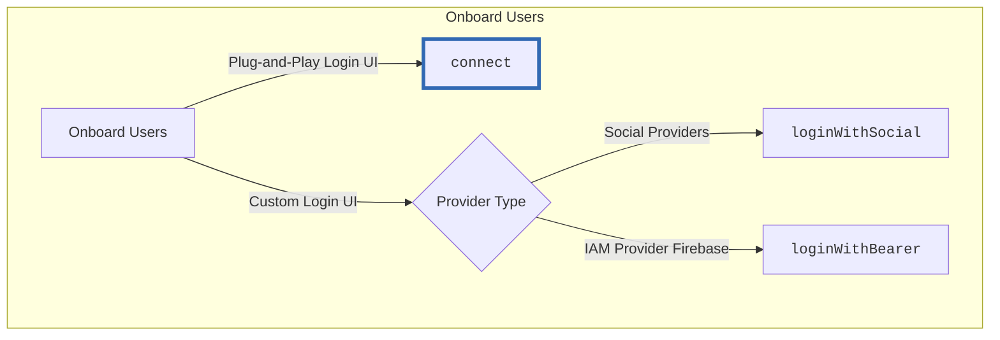

# Plug & Play Auth

Plug & Play Auth is the default login UI in {{config.extra.arcana.sdk_name}}. Web3 apps can use the [`connect`](https://authsdk-ref-guide.netlify.app/classes/authprovider#connect) method to show this built-in UI with the configured onboarding options from [{{config.extra.arcana.dashboard_name}}]({{page.meta.arcana.root_rel_path}}/concepts/dashboard.md).  Developers can use this ready-made UI instead of creating a [[concept-custom-login-ui|custom login UI]].

<figure markdown="span">
  
  <figcaption>Plug & Play Login UI</figcaption>
</figure>

## Compact Modal

The built-in plug-and-play login UI includes a compact modal and a normal-sized modal. Choose the compact modal by setting `compact: true` in `connectOptions` when instantiating `AuthProvider`. For more details, see [`AuthProvider` constructor parameters](https://authsdk-ref-guide.netlify.app/interfaces/constructorparams).



<figure markdown="span">
  
  <figcaption>Plug & Play Login UI Types</figcaption>
</figure>


