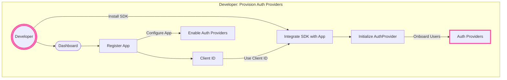
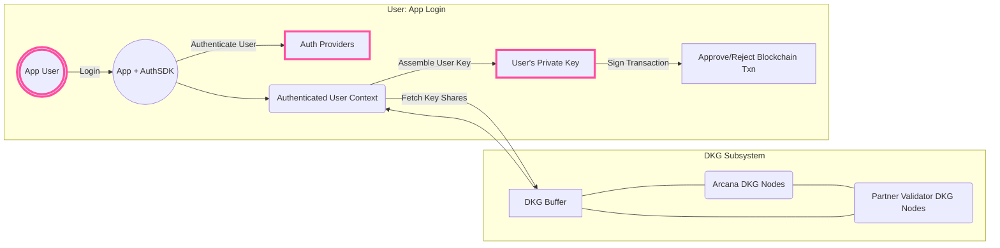

# DKG

Distributed Key Generation (DKG) uses cryptographic techniques to allow multiple parties to collaborate in generating a shared public and private key set, without relying on any trusted third parties for key retrieval. This is a departure from traditional public key encryption systems.

In the early alpha release, the {{config.extra.arcana.product_name}} protocol used Shamir's Secret Sharing (SSS) mechanism for generating distributed keys for authenticated Web3 app users. This enabled users to sign blockchain transactions using the embedded, non-custodial {{config.extra.arcana.wallet_name}}. However, SSS algorithm has its limitations. In the early beta release, the {{config.extra.arcana.product_name}} used the verifiable secret sharing (VSS) techniques and [[concept-adkg|asynchronous distributed key generation (ADKG)]] to solve several of the limitations of the SSS mechanism. 

Refer to the [[concept-how-adkg-works|latest ADKG implementation in Arcana Network]] for details. You can also find the older DKG implementation (deprecated), notes [[concept-how-dkg-works|here]]. 

## Keys Privacy

The {{config.extra.arcana.product_name}} protocol ensures that the user's keys are generated only on the client side and are fully secure, private.

* Once a user is authenticated, the required key shares are fetched by the client-side {{config.extra.arcana.sdk_name}} integrated with the Web3 app. These key shares are used to generate the user's private key locally within the app's authenticated user context. 

* User keys are **not** stored anywhere in the {{config.extra.arcana.company_name}} subsystems.

* After authentication, the user key share assignment is instant. The DKG protocol buffers key shares for fast allocation. Note these are key shares, not keys.

