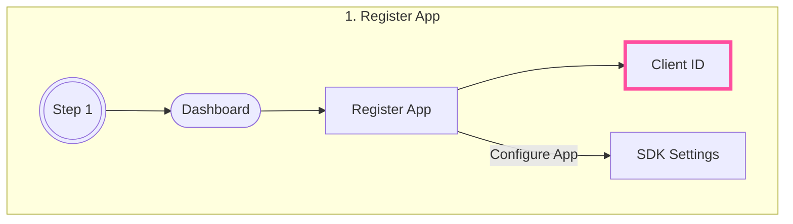
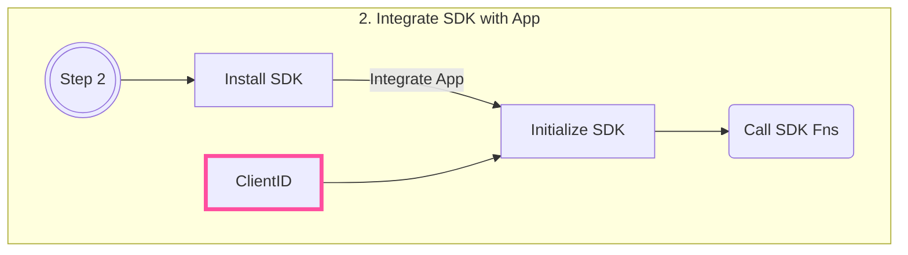

# Overview

!!! quote "Don't Panic!"

      All you really need to know for the moment is that the universe is a lot more complicated than you might think, even if you start from a position of thinking it’s pretty damn complicated in the first place.

      -- Douglas Adams (The Hitchhiker's Guide to the Galaxy)

{==

This documentation contains everything you need to get started using {{config.extra.arcana.company_name}} SDKs.

==}

**{{config.extra.arcana.company_name}}** SDKs bring higher conversion for Web3 app developers through [[concept-social-login|social login]] and [[concept-gasless-transactions|gasless transactions]].

Our client-side SDKs empower Web3 apps with social login and gasless transaction capabilities.

* **Auth SDK:**  Enables social login and gasless transactions through the in-app, embedded, non-custodial {{config.extra.arcana.wallet_name}}.
* **Gasless SDK:**  Extends the gasless transaction feature to third-party browser-based wallets.

## Use Model





## {{config.extra.arcana.sdk_name}}

{{config.extra.arcana.sdk_name}} helps Web3 apps to onboard users quickly, at scale, via popular social login providers. Authenticated users get access to the in-app, non-custodial {{config.extra.arcana.wallet_name}} instantly. The built-in gasless feature enables **zero gas fees** for whitelisted app operations. The SDK is easy to customize and integrate with various [[sdk-installation|Web3 app types]].

[[auth-overview|Learn more about {{config.extra.arcana.sdk_name}}...]]

```mermaid

flowchart LR 
    subgraph Step1 [{{config.extra.arcana.sdk_name}} Usage]
    direction LR
        A1(((Start))) -- 1. Register App --> B1(Dashboard Login)
        B1  --> C1[Get Client ID] --> E1
        A1 -- 2. Integrate App --> D1[Install Auth SDK] --> E1[Initialize <code>AuthProvider</code>] --> F1[Social Login Fns]
        E1 --> G1[Web3 Wallet Ops]
        E1 --> H1[Whitelisted Gasless Txn]
    end

classDef an-pink stroke:#ff4e9f,stroke-width:0.25rem;
class C1 an-pink
```

??? an-note "Already using {{config.extra.arcana.sdk_name}}?"

      

[[auth-quick-start|:fontawesome-solid-paper-plane:{ .icon-color } Auth Quick Start]]{.md-button}

## {{config.extra.arcana.gasless_sdk_name}}

The {{config.extra.arcana.gasless_sdk_name}} extends the gasless feature for third-party, browser-based wallets. The SDK works independently of the {{config.extra.arcana.sdk_name}}. 

[[gasless-overview| Learn More about {{config.extra.arcana.gasless_sdk_name}}...]] 

```mermaid

flowchart LR
      subgraph Step1 [{{config.extra.arcana.sdk_name}} Usage]
      direction LR
      A1(((Start))) -- 1. Register App --> B1(Dashboard Login)
      B1  --> C1[Get Client ID] --> E1
      A1 -- 2. Integrate App --> D1[Install Gasless SDK] --> E1[Initialize <code>SCW</code>] --> F1[Gasless Txn]
      E1 --> G1[Get Accounts]
      end

classDef an-pink stroke:#ff4e9f,stroke-width:0.25rem;
class C1 an-pink
```

??? an-note "Already using {{config.extra.arcana.gasless_sdk_name}}?"

      

[[gasless-standalone-quick-start|:fontawesome-solid-paper-plane:{ .icon-color } Gasless Quick Start]]{.md-button}

---

## More Information

[[new-to-web3|New to Web3]]? See [[index-tutorials|Tutorials]] and [[index-arcana-academy|Learn More...]]

Seasoned Web3 Developer? Try [[try-now-auth| Auth]] and [[try-now-gl| Gasless]] via Sandpack examples. Also, check [[index-guides|Developer Guides]], [[index-sdk-ref|SDK References]], [[index-deploy|Deployment and Migration]] Guides.

New to {{config.extra.arcana.wallet_name}}? See [[index-wallet-user-guide|Wallet User Guide]].

